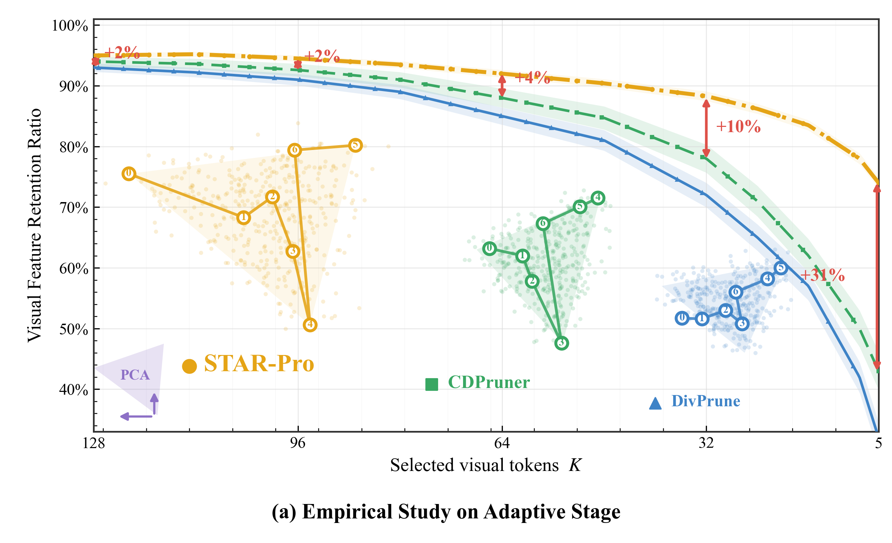
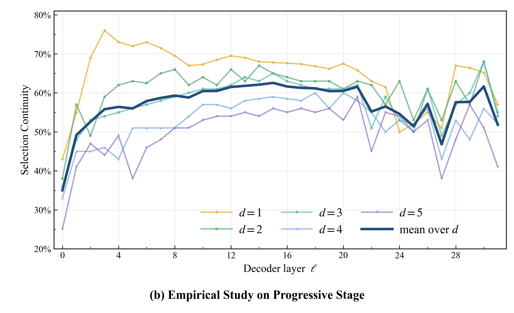

# Draw-in-Win

**Publication-ready scientific visualization recipes for modeling, correlation analysis, networks, sensitivity studies, and sports analytics.**

[简体中文](README.zh-CN.md) · [Visualization catalog](docs/CATALOG.md) · [Reproducibility guide](docs/REPRODUCIBILITY.md) · [Contributing](CONTRIBUTING.md)


Draw-in-Win is a curated collection of research visualization code developed around mathematical modeling projects. It brings together 71 Python scripts, 2 R scripts, bundled example datasets, and 136 retained figure artifacts in a structure designed for discovery, reuse, and paper-ready export.

The repository preserves the visual language of the original research work—high-resolution PNG previews, editable SVG figures, and vector PDF outputs—while removing duplicate copies, machine-specific paths, editor caches, and redistributable commercial font files.

## Collection examples

Every top-level collection has a representative preview and a directly runnable starting point.

| Scientific charts | Experimental charts |
|:--:|:--:|
|  |  |
| **Paper-style multi-model radar**<br>[Script](collections/scientific-charts/paper_style_multi_radar.py) · `python collections/scientific-charts/paper_style_multi_radar.py` | **Core–periphery network**<br>[Script](collections/experimental-charts/hexin_bianyuan.py) · `python collections/experimental-charts/hexin_bianyuan.py` |

| Sports analytics | Sensitivity analysis |
|:--:|:--:|
|  |  |
| **Player comparison radar**<br>[Script](collections/sports-analytics/Rank/player_radar_chart.py) · `python collections/sports-analytics/Rank/player_radar_chart.py` | **Omega sensitivity curves**<br>[Script](collections/sensitivity-analysis/omega_sensitivity_plot.py) · `python collections/sensitivity-analysis/omega_sensitivity_plot.py` |

| Model studies | SDG systems |
|:--:|:--:|
|  |  |
| **Season strategy comparison**<br>[Script](collections/model-studies/season-and-recovery/season_comparison_bar.py) · `python collections/model-studies/season-and-recovery/season_comparison_bar.py` | **SDG score evolution**<br>[Script](collections/sdg-systems/sdg_score_evolution.py) · `python collections/sdg-systems/sdg_score_evolution.py` |

The radar and empirical-stage examples reproduce the visual composition of paper figures from raster references. Their benchmark arrays, curve checkpoints, and search trajectories are explicitly documented as visually reconstructed placeholders and should be replaced with source measurements for quantitative use.

More previews are available in [`docs/assets/gallery`](docs/assets/gallery) and beside the scripts that generated them.

## Complete figure gallery

The gallery below displays all **56 unique retained previews**: every PNG under `collections/`, three standalone SVG-only figures, and three additional rendered figures that exist only in the curated gallery. Exact duplicate copies are shown once. Click any preview to open the full-resolution asset; alternate SVG/PDF exports remain beside their generating scripts where available.

### Scientific charts — 15 previews

| Paper-style multi-model radar | Scientific composite panel |
|:--:|:--:|
| [](collections/scientific-charts/paper_style_multi_radar.png) | [](collections/scientific-charts/scientific_combined_plot.png) |
| **Adaptive-stage token study** | **Progressive-stage continuity study** |
| [](collections/scientific-charts/adaptive_stage_empirical_study.png) | [](collections/scientific-charts/progressive_stage_empirical_study.png) |
| **Grouped bars with error** | **Grouped chord diagram** |
| [](collections/scientific-charts/grouped_bar_with_error.png) | [](collections/scientific-charts/grouped_chord_diagram.png) |
| **Chord-diagram legend** | **Mixed correlation matrix** |
| [](collections/scientific-charts/chord_diagram_legend.png) | [](collections/scientific-charts/mixed_correlation_matrix.png) |
| **Resilience trajectory** | **SDG final-score comparison** |
| [](collections/scientific-charts/resilience_trajectory_plot.png) | [](collections/scientific-charts/sdg_final_scores_plot.png) |
| **Static versus dynamic weights** | **Static/dynamic legend** |
| [](collections/scientific-charts/static_vs_dynamic_weights_plot.png) | [](collections/scientific-charts/static_vs_dynamic_legend.png) |
| **Strategy comparison** | **3D grouped bar chart** |
| [](collections/scientific-charts/strategy_comparison_plot.png) | [](docs/assets/gallery/3d-grouped-bar-chart.png) |
| **Hexagonal correlation heatmap** | |
| [](docs/assets/gallery/correlation-heatmap-hexagon.png) | |

### Experimental charts — 13 previews

| Regression and density diagnostics | Core–periphery network |
|:--:|:--:|
| [](collections/experimental-charts/40.png) | [](collections/experimental-charts/core_periphery_network.png) |
| **Polar bubble chart** | **Mantel correlation heatmap** |
| [](collections/experimental-charts/grain_polar_bubble.png) | [](collections/experimental-charts/mantel_heatmap.png) |
| **3D grouped waterfall** | **Nested coverage diagram** |
| [](collections/experimental-charts/output.png) | [](collections/experimental-charts/recreated_chart.png) |
| **Smooth radial chart, v2** | **Smooth radial chart** |
| [](collections/experimental-charts/smooth_radial_chart_v2_1.png) | [](collections/experimental-charts/smooth_radial_chart.png) |
| **Smoothed spectral plot** | **Spectral plot** |
| [](collections/experimental-charts/spectral_plot_smooth.png) | [](collections/experimental-charts/spectral_plot.png) |
| **XGBoost and SHAP analysis** | **Grain-yield chart** |
| [](docs/assets/gallery/xgb-shap-analysis.png) | [](collections/experimental-charts/grain_yield_chart.svg) |
| **Linear-fit diagnostics** | |
| [](collections/experimental-charts/xianxingnihe.svg) | |

### Sports analytics — 16 previews

| 3D grouped bars, W | 3D grouped bars, solid style |
|:--:|:--:|
| [](collections/sports-analytics/3d_bar_W_output.png) | [](collections/sports-analytics/3d_bar_W_solid_output.png) |
| **3D grouped bars, v2** | **3D grouped bars, alternate SVG** |
| [](collections/sports-analytics/3d_bar_W_v2_output.png) | [](collections/sports-analytics/3d_bar_W_output_1.svg) |
| **3D waterfall, W variant 2** | **3D waterfall, C** |
| [](collections/sports-analytics/3d_waterfall_2_W.png) | [](collections/sports-analytics/3d_waterfall_C.png) |
| **3D waterfall, P** | **3D waterfall, W** |
| [](collections/sports-analytics/3d_waterfall_P.png) | [](collections/sports-analytics/3d_waterfall_W.png) |
| **Revenue composition donut** | **Roster-flow Sankey diagram** |
| [](collections/sports-analytics/Components/lakers_revenue_donut.png) | [](collections/sports-analytics/Components/lakers_sankey.png) |
| **Monte Carlo raincloud** | **Player-ranking petal chart** |
| [](collections/sports-analytics/monte_carlo_raincloud.png) | [](collections/sports-analytics/player_ranking_petal.png) |
| **Player delta-V ranking** | **Player-ranking rose chart** |
| [](collections/sports-analytics/Rank/lakers_deltaV_bar_chart.png) | [](collections/sports-analytics/Rank/lakers_ranking_rose_chart.png) |
| **Player comparison radar** | **Ribbon encoding** |
| [](collections/sports-analytics/Rank/player_radar_chart.png) | [](collections/sports-analytics/tiaodai_output.png) |

### Sensitivity analysis — 3 previews

| Omega sensitivity, W | Omega sensitivity, P |
|:--:|:--:|
| [](collections/sensitivity-analysis/omega_sensitivity_W.png) | [](collections/sensitivity-analysis/omega_sensitivity_P.png) |
| **Omega sensitivity, C** | |
| [](collections/sensitivity-analysis/omega_sensitivity_C.png) | |

### Model studies — 8 previews

| Baseline candidate ranking | Case-B candidate ranking |
|:--:|:--:|
| [](collections/model-studies/dynamic-ranking/Dynamic/baseline_candidate_rank_bar.png) | [](collections/model-studies/dynamic-ranking/Dynamic/case_b_candidate_rank_bar.png) |
| **Cash-flow scatter** | **Investment/popularity scatter** |
| [](collections/model-studies/investment-and-popularity/Model_4新/cash_flow_scatter.png) | [](collections/model-studies/investment-and-popularity/Model_4新/investment_pop_scatter.png) |
| **Popularity comparison** | **Popularity composition pie** |
| [](collections/model-studies/investment-and-popularity/pop_comparison.png) | [](collections/model-studies/investment-and-popularity/pop_pie_chart.png) |
| **Season strategy comparison** | **Multi-season recovery trajectory** |
| [](collections/model-studies/season-and-recovery/season_comparison_bar.png) | [](collections/model-studies/season-and-recovery/v_recovery_plot.png) |

### SDG systems — 1 preview

| SDG score evolution | |
|:--:|:--:|
| [](collections/sdg-systems/sdg_score_evolution.png) | |

## What is included

| Collection | Focus | Code | Retained outputs |
|---|---|---:|---:|
| [`scientific-charts`](collections/scientific-charts) | Correlation matrices, chord diagrams, multi-model radars, empirical-stage studies, 3D comparisons, resilience and SDG strategy plots | 18 Python + 2 R | 30 |
| [`experimental-charts`](collections/experimental-charts) | Polar bubbles, radial layouts, regression panels, core–periphery graphs, XGBoost/SHAP | 19 Python | 21 |
| [`sports-analytics`](collections/sports-analytics) | Player rankings, roster flows, revenue composition, Monte Carlo and 3D waterfalls | 16 Python | 39 |
| [`sensitivity-analysis`](collections/sensitivity-analysis) | Parameter sweeps and comparative sensitivity curves | 3 Python | 9 |
| [`model-studies`](collections/model-studies) | Dynamic ranking, investment/popularity scenarios, season and recovery comparisons | 9 Python | 24 |
| [`sdg-systems`](collections/sdg-systems) | Dynamic weights, score evolution, network centrality, Spearman inputs, and supporting model code | 6 Python | 3 + data/model support |

See the [visualization catalog](docs/CATALOG.md) for chart families, representative scripts, input requirements, and expected output formats.

## Repository layout

```text
Draw-in-Win/
├── collections/
│   ├── experimental-charts/       # exploratory and advanced chart designs
│   ├── model-studies/
│   │   ├── dynamic-ranking/
│   │   ├── investment-and-popularity/
│   │   └── season-and-recovery/
│   ├── scientific-charts/         # general scientific figure recipes
│   ├── sdg-systems/               # SDG network/model inputs and utilities
│   ├── sensitivity-analysis/
│   └── sports-analytics/
├── docs/
│   ├── assets/gallery/             # normalized README previews
│   ├── CATALOG.md
│   └── REPRODUCIBILITY.md
├── tools/check_repository.py       # dependency-free repository health check
├── CONTRIBUTING.md
├── README.zh-CN.md
└── requirements.txt
```

Data is intentionally kept near the scripts that consume it. This minimizes hidden coupling and makes each collection easier to inspect independently.

## Quick start

### 1. Clone and create an environment

```bash
git clone https://github.com/Haohaha-11/Draw-in-Win.git
cd Draw-in-Win
python -m venv .venv
```

Activate it on Windows:

```powershell
.venv\Scripts\Activate.ps1
```

Or on macOS/Linux:

```bash
source .venv/bin/activate
```

### 2. Install dependencies

```bash
python -m pip install --upgrade pip
python -m pip install -r requirements.txt
```

The full requirements file includes the heavier machine-learning stack used by the SHAP examples. If you only want Matplotlib-based figures, install `numpy pandas matplotlib scipy seaborn networkx openpyxl` first and add optional packages as needed.

The two R examples require `tidyverse`, `ggplot2`, and `reshape2`.

### 3. Run a self-contained example

Generate the featured four-panel radar comparison:

```bash
python collections/scientific-charts/paper_style_multi_radar.py
```

The script exports matching PNG, SVG, and PDF files beside itself. Reproduce the two paper-style empirical-stage studies with:

```bash
python collections/scientific-charts/adaptive_stage_empirical_study.py
python collections/scientific-charts/progressive_stage_empirical_study.py
```

Both scripts also accept `--output-dir` and `--dpi`. Their embedded values are deterministic visual estimates from the raster reference, not recovered experimental measurements. To try the broader scientific composite example:

```bash
python collections/scientific-charts/scientific_combined_plot.py
```

This example uses generated data and writes SVG and PNG files beside the script. For scripts using bundled data, run them from their collection directory unless the script already resolves paths from `__file__`:

```bash
cd collections/model-studies/season-and-recovery
python season_comparison_bar.py
```

## Reproducibility levels

The collection contains three kinds of recipes:

1. **Self-contained** — synthetic or embedded data; runs after dependencies are installed.
2. **Bundled-data** — reads CSV/XLSX assets committed beside the script.
3. **External-data template** — retained research code whose original input was not part of the source archive. Machine-specific paths have been replaced with documented repository-relative locations.

The exact conventions and missing-input layout are documented in the [reproducibility guide](docs/REPRODUCIBILITY.md). A script being syntactically valid does not imply that its domain-specific external dataset is included.

## Output conventions

Most recipes export one or more of the following:

- **PNG** at 300 DPI for previews, reports, and slides.
- **SVG** for editable vector artwork and web use.
- **PDF** for publication workflows and LaTeX documents.

The historical scripts generally write outputs beside themselves. Existing generated artifacts are retained so that visual designs can be evaluated without rerunning every model. When adapting a recipe, prefer `pathlib.Path(__file__).resolve().parent` for both input and output paths.

## Fonts and portability

The original project used Times New Roman font binaries from a local machine. Those files are deliberately not distributed here. Normalized scripts use Matplotlib's bundled **DejaVu Serif**, providing a redistributable and cross-platform fallback. You may set `font.family` to Times New Roman locally if your system installation and publication requirements permit it.

## Data and model safety

- CSV and XLSX files are ordinary tabular inputs; inspect their schemas before substituting your own data.
- Pickle/joblib model files can execute code during deserialization. Only load the bundled `.pkl` artifacts if you trust this repository and never load untrusted replacements.
- The HTML demos use third-party CDN resources and therefore need a network connection when opened.
- No API keys, credentials, or personal access tokens are required by the visualization scripts.

## Quality checks

Run the dependency-free health check before contributing:

```bash
python tools/check_repository.py
```

It verifies Python syntax, required documentation, gallery links, prohibited redistributable font files, and accidental machine-specific absolute paths. GitHub Actions runs the same check on pushes and pull requests.

## Project history

This repository is a curated and deduplicated presentation of an internal mathematical-modeling visualization workspace. Original topic clusters were reorganized into descriptive collections; exact duplicate nested copies, build caches, editor metadata, and proprietary font binaries were excluded. The source workspace is not modified by this curation process.

## Contributing

Contributions that improve portability, accessibility, visual consistency, or reproducibility are welcome. Please read [CONTRIBUTING.md](CONTRIBUTING.md) before opening a pull request. In particular, keep input data small and documented, avoid absolute paths, and commit at least one representative preview for a new chart family.

## Citation

If this collection supports your research or teaching, cite the repository:

```bibtex
@software{draw_in_win,
  author  = {Haohaha-11},
  title   = {Draw-in-Win: Scientific Visualization Recipes for Mathematical Modeling},
  year    = {2026},
  url     = {https://github.com/Haohaha-11/Draw-in-Win}
}
```

## License

No open-source license has been selected for this repository yet. Unless a license file is added, the code and assets remain **all rights reserved**. Third-party libraries and CDN resources retain their own licenses.
