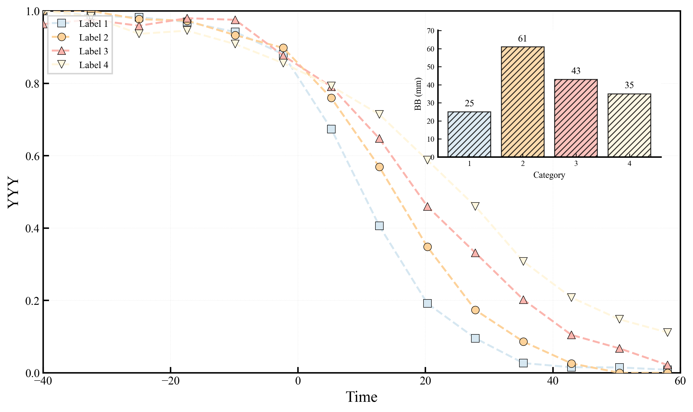
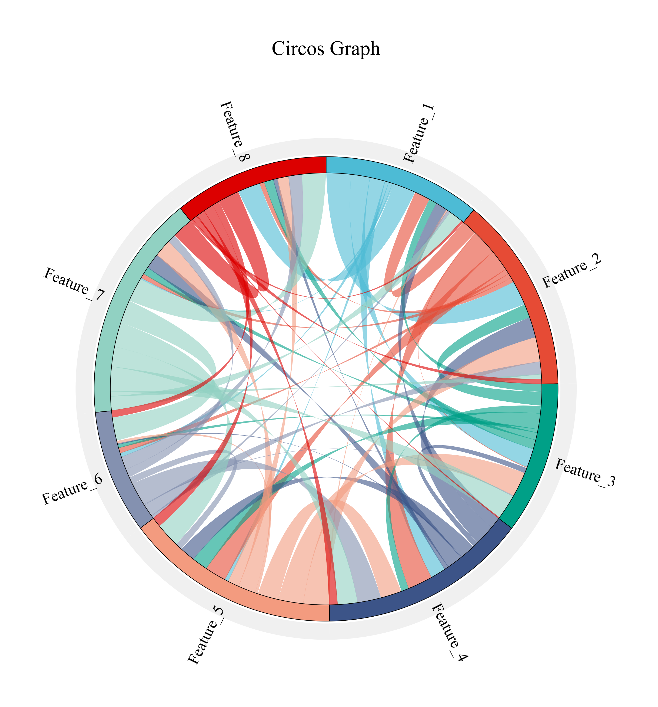
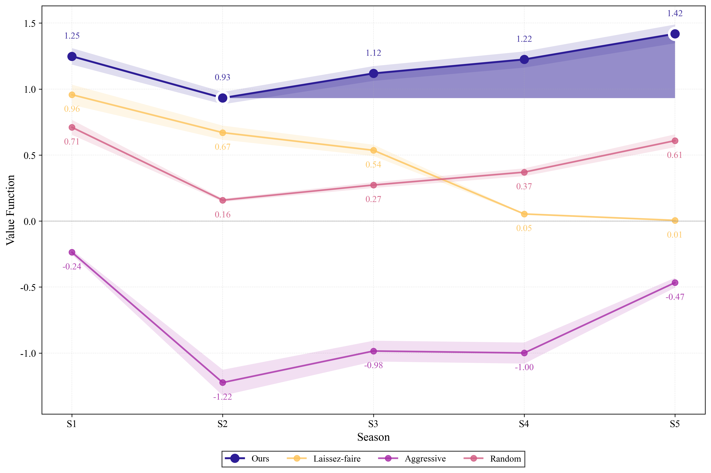

# Draw-in-Win

**面向数学建模、科研论文与数据分析的高质量可视化代码集。**

[English README](README.md) · [图表目录](docs/CATALOG.md) · [复现说明](docs/REPRODUCIBILITY.md) · [贡献指南](CONTRIBUTING.md)

Draw-in-Win 是从真实数学建模研究项目中整理出的科研绘图库，现收录 **67 个 Python 脚本、2 个 R 脚本、配套示例数据，以及 124 个保留的 PNG/SVG/PDF 图表文件**。仓库重点覆盖相关性分析、网络关系、极坐标可视化、三维图、参数敏感性、模型对比、体育运营分析与可解释机器学习。

整理过程中保留了原图的论文级导出能力，同时完成了主题归档、确定重复项清理、机器绝对路径替换、商业字体文件排除和自动质量检查。原始代码目录没有被修改。

## 精选图表

| 组合科研图 | 网络关系 |
|:--:|:--:|
|  |  |

| 混合相关性矩阵 | 三维分组对比 |
|:--:|:--:|
|  |  |

| 桑基流图 | 蒙特卡洛分布 |
|:--:|:--:|
|  |  |



## 内容结构

| 主题集合 | 主要内容 |
|---|---|
| [`scientific-charts`](collections/scientific-charts) | 相关性矩阵、弦图、组合科研图、SDG 策略对比和三维图 |
| [`experimental-charts`](collections/experimental-charts) | 极坐标气泡、雷达图、玫瑰图、回归拟合、核心—边缘网络、XGBoost/SHAP |
| [`sports-analytics`](collections/sports-analytics) | 球员排名、阵容流动、收入构成、蒙特卡洛分析和三维瀑布图 |
| [`sensitivity-analysis`](collections/sensitivity-analysis) | 不同参数配置下的敏感性比较 |
| [`model-studies`](collections/model-studies) | 动态排名、投资—热度关系、赛季决策和恢复过程 |
| [`sdg-systems`](collections/sdg-systems) | 动态权重、网络中心性、Spearman 数据与模型辅助代码 |

更细的“图表类型—代码—数据—输出格式”对应关系见[图表目录](docs/CATALOG.md)。

## 快速开始

```bash
git clone https://github.com/Haohaha-11/Draw-in-Win.git
cd Draw-in-Win
python -m venv .venv
```

Windows PowerShell：

```powershell
.venv\Scripts\Activate.ps1
python -m pip install --upgrade pip
python -m pip install -r requirements.txt
```

运行一个不依赖外部数据的组合科研图示例：

```bash
python collections/scientific-charts/scientific_combined_plot.py
```

运行包含配套数据的赛季对比示例：

```bash
cd collections/model-studies/season-and-recovery
python season_comparison_bar.py
```

R 语言示例还需要安装 `tidyverse`、`ggplot2` 和 `reshape2`。

## 可复现性分级

仓库中的代码分为三类：

1. **完全自包含**：脚本内部生成数据，安装依赖后即可运行。
2. **仓库数据驱动**：CSV/XLSX 数据与脚本一并保留。
3. **外部数据模板**：原项目输入数据不在旧代码目录中；原有本机绝对路径已经改成清晰的仓库相对路径，并在文档中写明预期文件结构。

具体说明见[复现指南](docs/REPRODUCIBILITY.md)。部分历史脚本通过语法检查并不代表其专用研究数据已经包含在仓库内。

## 输出与排版

- PNG：通常以 300 DPI 输出，适合报告、幻灯片和快速预览。
- SVG：适合在 Illustrator、Inkscape 或网页环境中继续编辑。
- PDF：适合论文排版和 LaTeX 工作流。

历史脚本一般将图表输出到脚本所在的 collection。仓库同时保留了代表性成品，便于不运行模型就能查看设计效果。

## 字体与跨平台兼容

旧项目曾直接引用本机的 Times New Roman 字体文件。为了避免商业字体再分发风险，新仓库不包含相关 TTF/ZIP 文件，并统一使用 Matplotlib 自带的 **DejaVu Serif** 作为可移植回退字体。如本机已合法安装 Times New Roman，可按投稿规范自行切换 `font.family`。

## 质量检查

```bash
python tools/check_repository.py
```

该检查会验证所有 Python 文件的语法、必需文档、README 图像链接、商业字体文件、疑似密钥和机器专用绝对路径。相同检查也会在 GitHub Actions 中运行。

## 数据安全说明

- 加载自定义 CSV/XLSX 前，请先确认列名和量纲与脚本预期一致。
- Pickle/joblib 文件在反序列化时可能执行代码，只应加载可信来源的 `.pkl` 文件。
- HTML 示例依赖第三方 CDN，离线环境下可能无法完整显示。
- 绘图代码不需要 API Key、访问令牌或其他账号凭证。

## 贡献与引用

新增图表时，请避免硬编码绝对路径，附带小型、可公开的数据样例，并至少提交一张代表性预览。完整要求见[贡献指南](CONTRIBUTING.md)。

引用格式可使用：

```bibtex
@software{draw_in_win,
  author  = {Haohaha-11},
  title   = {Draw-in-Win: Scientific Visualization Recipes for Mathematical Modeling},
  year    = {2026},
  url     = {https://github.com/Haohaha-11/Draw-in-Win}
}
```

## 许可证

仓库目前尚未选择开源许可证。在正式添加许可证文件之前，代码和图表资产默认为**保留所有权利**；第三方依赖及 CDN 资源分别遵循其自身许可证。
